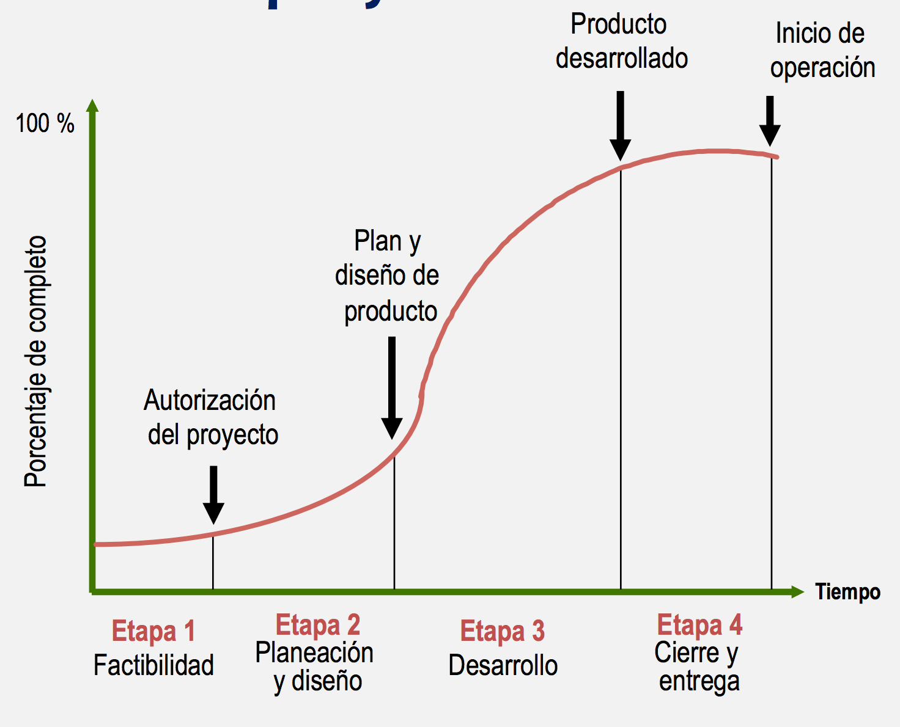
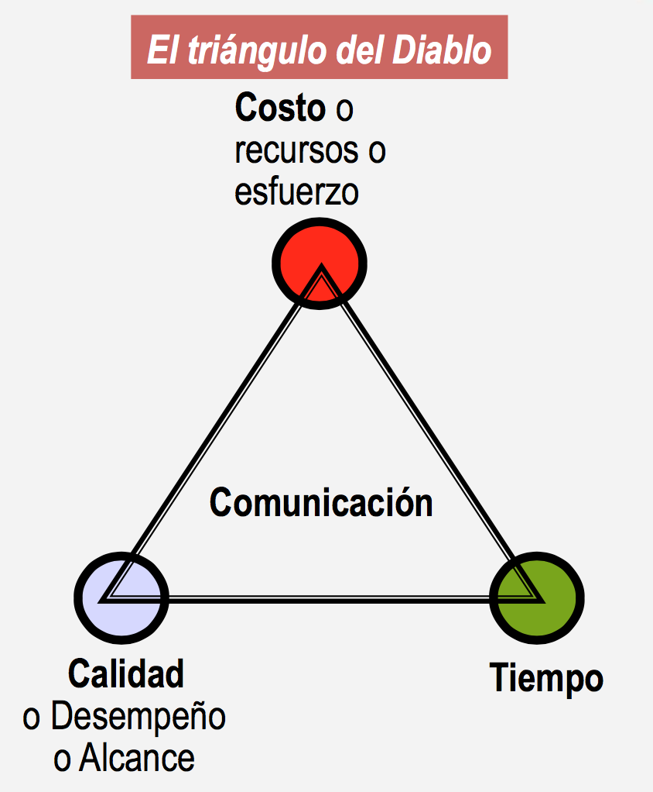

# 11-Sep-2017

###### Profes:
* MTY: Adan Lopez Miranda
* GDL: Gilberto Cruz
* SFE: Filiberto Gonzalez

## Procesos para administrar proyectos
* Inicio
* Planeacion
* Monitoreo
* Programacion
* Cierre

### Ciclo de Vida

Al principio del proyecto hay mucha incertidumbre pero aun asi hay que tomar decisiones. 

Las decisiones que se toman al principio del proyecto, a pesar de ser las que se toman con menos information, son las que mas impacto tienen. Para protegerse en estos casos hay que hacer analisis de riesgo y otros procesos para buscar tomar la mejor decision o tener un plan de accion en caso de que se tome una mala decision.

La atencion de los stakeholders del proyecto se incrementa cuando se trata con temas que afectan directamente en el costo, tiempo y alcance del proyecto. 

Un stakeholder que desea modificar el valor de una de las variables anteriores debe estar dispuesto a ceder en las otras dos. **i.e** Cambiar drasticamente el alcance involucra aumento de costos y tiempo.

### Proyecto vs Proceso
* Un proyecto se ejecuta una sola vez y un proceso es aquel que se repite muchas veces y pierde novedad.
* El proceso se crea de forma pragmatica cuando surgen proyectos similares y se identifica una oportunidad para crear un proceso, Administracion de procesos es mas eficiente.

## Dudas
Que onda con proyectos que nunca se ejecutan?
Como se mantiene en caso de cambios de tecnlogia o herramientas.

No