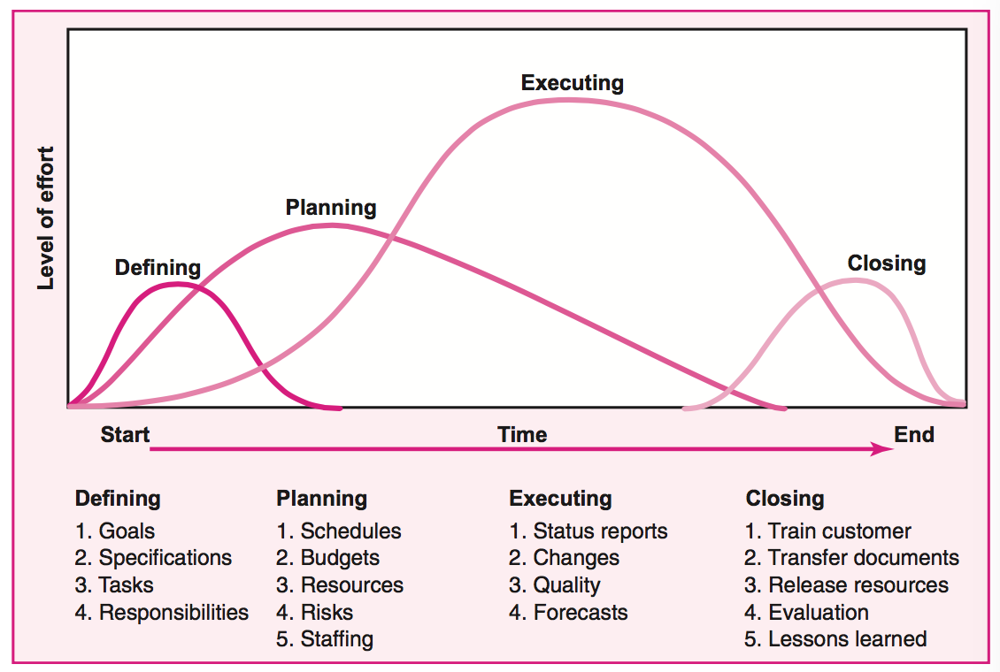
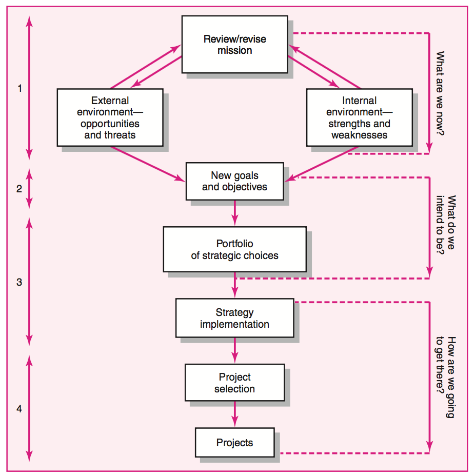

# Chapter 1: Modern Project Management

Un **proyecto** es una tarea temporal que se ejecuta para obtener un producto unico, un servicio o un resultado. Su mayor proposito es satisfacer las necesidades de un cliente.

Tiene las siguientes caracteristicas:

1. Tiene un objetivo
2. Tiene un lapso marcado por un inicio y un fin
3. Normalmente involucra diversos departamentos
4. Tipicmante involucra hacer algo que nunca antes se ha hecho
5. Tiene requrimientos de tiempo, costo y performance expecificos

Un **Programa** es el conjunto de muchos projectos que buscan resolver un objetivo en comun en un periodo de tiempo grande.

**Ciclo de Vida de un Proyecto**

1. Definicion
2. Planeacion
3. Ejecucion
4. Cierre (Entrega, redeployment de recursos, revision)

Hoy en dia hay mucha demanda de Project Management por diversas razones que han cambiado a forma en que se debe hacer tracking de proyectos **i.e** Reduccion de ciclos de vida de productos, nuevo conocimiento, busqueda de sostenibilidad, incremento en customer focus, etc.

El manejo de **Portafolio** engloba el trabajo de project management de toda una organizacion. Se maneja por un grupo de gente que tiene comunicacion con los miembros del board y los project managers.

Las principales funciones de un portafolio son:

1. Monitorear la seleccion de proyectos
2. Monitorear skills y recursos globales
3. Fomentar el uso de best practices
4. Balancear los proyectos del protafolio para mitigar riesgos en la organizacion
5. Mejorar comunicacion entre los stakeholders
6. Crear perspectiva total de la organizacion para evitar el trabajo en silos
7. Mejorar el manejo de proyectos a traves del tiempo.

Hay dos dimensiones en el proceso de implementar un proyecto:

La parte **tecnica**: son los procesos logicos y concretos que se ejecutan durante el proyecto. Deben ser elementos documebtables y rastreables. En el caso de fallas se puede hacer un trace para encontrar el problema. Un buen PM debe estar entrenado en los aspectos tecnicos del proyecto.

La parte **sociocultural**: Todo el desmadre de jurisdicciones, cultura, burocracia, etc, etc que se debe manejar durante un proyecto. Esta dimension tambien cubre la interaccion del proyecto con elemntos externos al mismo.

Hay que saberle a las dos...

# Chapter 2: Organization Strategy

La **estrategia** se define a traves de proyectos. Todos los proyectos deben tener un link claro a la estrategia de la organizacion.

Un Project Manager debe pensar estrategicamente para tomar decisiones en base a la estrategia de la organizacion. **i.e:** aprobar horas extra en caso de que la estrategia de la organizacion sea dar prioridad a deliveries en tiempo. Tambien es necesario conocer la estrategia para poder abogar por el proyecto frente a los stakeholders.

**Pasos del proceso de Manejo estrategico**

1. Revisar y definir la mision organizacional
2. Establecer metas y objetivos de largo plazo
3. Analizar y formular estrategias para cumplir los objetivos
4. Implementar las estrategias a traves de proyectos

La mision no es permanente pero no debe sufrir cambios muy seguido. No debe tener ambiguedad porque si se puede interpretar de varias formas se pierde alineamiento entre proyectos.

Los objetivos deben ser **SMART:** **S**pecific **M**easurable **A**ssignable **R**ealistic **T**ime related

Las estrategias responden a la pregunta de _Que se debe hacer para cumplir los objetivos?_ Se definen varias alternativas basado en diversos valores de ambientes internos y externos como tecnologia, riesgo, competencia, etc. A ese analisis se le conoce como SWOT. En base al resultado de ese analisis y la alineacion con la mision se hace la seleccion de las estrategias a seguir y se propagan las responsabilidades a los departamentos correspondientes.

La implementacion de una estrategia responde a la pregunta de _Como se van a ejecutar las estrategias?_ Una vez seleccionada una estrategia se divide en diversos proyectos conectados que apuntan al cumplimiento de la misma.

To Do

# Chapter 3:
To Do

# Chapter 4: Defining the Project
Cuando un PM maneja un solo proyecto es sencillo armar los budgets y controlar la informacion del mismo. Cuando hay mas de uno se pierde el detalle de los mismos. Para solucionar esto hay 5 pasos tipo cookie cutter para tener la informacion de todos los proyectos lista para stakeholders.

## 1. Definir el scope
La definicion del scope da el banderazo para la implementacion de un proyecto. Fallas en este paso repercuten enormemene el proyecto y pueden destinarlo a fracasar. Para siempte apuntar a tener un buen scope se puede cumplir el siguiente checklist:

1. Project Objective
2. Deliverables
3. Milestones
4. Technical Requirements
5. Limits and exlusions
6. Reviews with Customer

El scope se describe en un SOW. Con un buen scope, sin ambiguedades, se evita caer en scope creep. Un Project Charter es un doc escrito por upper management que le da permiso al PM de iniciar y controlar un proyecto. 

## 2. Establecer Prioridades
Las 3 variables a considerar en el set up de prioridades y que definen la calidad del proyecto son **Scope**, **Costo** y **Tiempo**. Modificar una tiende a afectar el resultado de las otras dos de forma positiva o negativa. Para no andar batallando se puede hacer una matriz de prioridades. Las 3 variables en contra de las acciones de **constrain**, **enchance** y **accept**.

## 3. Crear Work Breakdown Structure
Este paso se refiere a dividir el trabajo en chunks mas pequeños hasta que cada pedazo caiga en responsabilidad de una sola persona. **i.e:** Proyecto, Epics, Stories, Tasks. el ultimo cachito (**work package**: what, how long, cost, how much, who, how well) representa las diversas tareas para logar el anterior y se divide en tipo de trabajo **i.e:** review, programming, testing. Hacer esto permite confirmar que todas las necesidades del proyecto se pueden cubrir por algun recurso disponible a la organizacion.

## 4. Integrar el WBS con la Organizacion
Al cruze del WBS con la organizacion se le llama Organization Breakdown Structure (OBS). Con el OBS y WBS generados estos se pueden combinar para formar una matriz que inmediatamente despliega el accounablitily de los entregables. Verticalmente se puede monitorear entrgables y horizontalmente las reponsabilidades.

## 5. Coding del WBS para el Sistema de Informacion
Una vez listo el WBS se debe identificar cada tarea y subtarea con un sistema que tenga sentido dentro de la organizacion. Se puede usar identacion dentro de una lista donde cada punto de identacion anida mas un entregable. Con la jerarquia de tareas lsita tambien se puede incluir letras y otros identificadores para hacer un mapping directo de un work package a las areas correpondientes.

## Matrices de Responsabilidad
En caso de que el tamaño del proyecto no amerite la creacion y cruce entre WBS y OBS se puede utilizar una matriz de responsabilidades. En la cual se asigna aquella persona que va a ejecutar una tarea y quienes pueden ser consultados. Las matrices pueden variar en la informacion que aportan, tipo la RACI. Que define accaountability, a quien informar, a quien consultar, etc.

## Plan de Comunicacion
Una vez que los entrgables y responsabilidades se han definidio es necesario crear un plan de comunicacion para informar sobre el progreso del proyecto. El plan de comunicacion busca resolver las siguientes preguntas.

* Que informacion debe ser recolectada y cuando?
* Quien va a recibir la informacion?
* Que meetodos se van a usar para juntar y almacenar la informacion.
* Cuales son los limites de accesso a la informacion?
* Cuando se debe comunicar la informacion?
* Como se va a comunicar?

Para cubrir estas pregunas se pueden seguir los siguientes pasos basicos:

1. Analysis de Stakeholders
2. Necesidades de informacion de stakeholders
3. Identificar Fuentes de Informacion
4. Definir formas de esparcier la inofrmacion.
5. Determinar quien y cuando se va a liberar la informacion.

# Chapter 5: Estimating Project Time and Costs
La estimacion es la linea guia para todo el proyecto. Cagarla en la estimacion te deja un camino complicado para completar el proyecto pero para hacer una buena estimacion se necesita invertir tiempo y dinero. Como a veces no es factible tener estos datos hay varios metodos que se pueden ejecutar para cubrir la necesidad.

## Factores que afectan la calidad de estimados

* **Planning Horizon**: Eventos en corto son mas faciles de estimar con mejor accuracy. Mientras mas lejano el trabajo mas complejo se vuelve estimarlo.
* **Project Duration**: Proyectos de muy larga duracion tienden a afectar los estimados.
* **People**: El factor de gente siempre jode las estimaciones. Gente con experiencia da diferntes datos a gente sin ella. Estimaciones basadas en dias no toman en cuenta que la productividad total esta cerca de 5 a 6 horas y no de otro numero esperado.
* **Project Structure and Organization**: los integrantes del equipo afectan la ejecucion y pueden no seguir las estimaciones. Equipos grandes necesitan mas comunicacion asi que se tardan mas.
* **Padding Estimates**: A veces por tantearle el agua a los camotes le pones un extra a los estimados para no fallarle. Esto algunos PMs los toman en cuenta asi que hasta se dan el lujo de reducir siempre ese padding de las tareas. Entre este juego se genera poca accuracy en estimados.
* **Organization Culture**: La organizacion del proyecto puede hacer que todo lo anterior tenga variaciones.
* **Otros**: Hay mil ocho mil cosas mas.

## 7 pasos para buenos estimados
Como estimar esta cabron estas 7 cosas se pueden hacer para no cagarla.

1. **Responsability**: Jalate a la raza que va a hacer la tarea, de esta forma es gente que sabe de lo que esta hablando. Va a demostrar mas interes si los metes a la jugada y puedes recibir accountability porque ellos mismos ponen el estimado, haciendose responsables de ejecutarlo en tiempo.
2. **Several people to estimate**: Hay que jalar a caria raza para tener aproximados reales basados en diferentes niveles de expertis. Platicando entre varios ademas se llega a un consenso y se eliminan extremos.
3. **Normal Conditions**: Las estimaciones deben hacerse basadas en una ejecucion de la tarea en condiciones normales.
4. **Time Units**: Hay que usar la unidad correcta de tiempo segun el proyecto. Se debe definir al principio y todas las tareas deben usar la misma unidad.
5. **Independence**: Todas las tareas deben estimarse indepentiendemente de las otras. No es bueno agrupar tareas y poner un estimado al total porque luego hay ambiguedad al repartir ese estimado.
6. **Contingencies**: EL estimado no debe incluir padding de contingencias. Mas bien el proyecto como un todo debe tener parte del budget asignado a estos casos.
7. **Risk assement**: Un analisis de riesgo durante la estimacion ayuda a evitar sorpresas. Desde solo dividir camino optimista y pesimista permite llegar a un estimado que cubra amos casos.

## Top-Down vs. Bottom-Up
Para estimar hay dos formas. **Top-Down** se refiere a uan estimacion de caracter estrategica donde se define un estimado basado en experiencia e informacion para determinar el total de tiempo y costo. Esto se hacen sin tener NPI de las tareas a ejecutra. **Bottom-Up** en cambio se trata de analizar las tareas mas basicas y llevar los totales hacia arriba. Ambas tienen sus pros y contras. Lo mejor es hacer un Top-Down, luego hacer el WBS/OBS, hacer el bottom-up y finalmente llegar a un acuerdo entre los estimados que no hacen match. Lo ideal es hacer esto **antes** de cerrar negociaciones y asi.

### Metodos Top-Down

* Consensus: Usar el expertis de los rifludos para llegar a un acuerdo del tiempo y precio esperado de un proyecto.
* Ratio: Usas calculos basados en ciertas reglas. Como estimar el costo y tiempo de una casa basado en metros cuadrados
* Apportion: Extension de ratio y se usa cuando un proyecto sigue otros pasados en requerimientos y costos
* Function Points: Se parametrizan puntos de los requerimientos y se calcula el total con base en una formila. Tipo software y asi, sabes como?
* Learning Curves: En proyectos que se ejecuta casi la misma accion varias veces se puede reducir la estimacion despues de la experiencia de ejecutar la tarea en fases iniciales.

### Metodos Bottom-Up
* Templates: Se usan cuando se han ejecutado proeyctos similares antes. Tipo templates de Licho y guayo
* Parametrizacion en tareas especificas: Se calcula el total basado en la ejecucion de una sola tarea.
* Range: Juntas a varia raza a sacar los estimados mas bajos, medios y altos junto con un nivel de riesgo que crean que se puede cumplir o no. Con este detalle el project managaer ya sabe que pedo para preparar la mitigacion de riesgos y asi.

### El hibrido aca
Se puede utilizar un hibrido en proyectos de turbo incertidumbre.
* Phase: Primero se tantea con un top-down y luego se refina con bottom-up en cada una de las fases que se ejecutan del proyecto. Esta cabron porque parece cheque en blanco pues en cada fase los estimados de tiempo y costo pueden variar bien cabron. Pero el cliente tambien puede tomar decisiones sobre cada fase que afectan el comportamiento de las nuevas estimaciones.

-
El **Nivel de detalle** debe ser un balance para solo expresar las cosas necesarias.

## Tipos de costo
**Costo directo** son las cosas que literalmente se tienen que pagar. Tipo horas programadas o uso de equipo rentado

**Costos de Overhead del Proyecto** Son costos como el tiempo del PM y sel SA que cobramos en Ooshala. No son cosas directas pero influyen en la ejecucion del proyecto. Normalmente son ratios.

**Costos de Overhead Generales y administrativos** Son de que igual sin ejecutarse en el proyecto pero presentes y son pedos de la organizacion que ejecuta el proyecto

-
Al final despues de tanto pedo igual los PMs a veces le meten un multiplicador a los esfuerzos. Esto es porque no necesariamente se cumplen las asumptions con las que se hacen las estimaciones. Como tareas aisladas o como que las cosas van a salir bien a la primera.

Pero la mejor forma de mejorar los estimados es a traves de la compilacion de experiencias pasadas para tomarse en cuenta al momento de hacer estimaciones para proyectos similares en el futuro.

# Chapter 6: 

# Chapter 7: 

# Chapter 8: Scheduling Resources and Costs
En un mundo bonito hay casos donde los recursos son suficientes. Pero se debe tomar en cuenta picos y valles en la utilizacion. Se aplica **resource smoothing** cuando se aprovecha el slack de tareas para distribuir la carga de trabajo y no tener altas demandas en momentos super random.

Las 3 metas de resource smoothing:

* Reducir picos de demanda de recursos
* Reducir el numero de recursos totales en el proyecto
* Minimizar fluctuaciones en el uso de recursos.

Smoothing esta chido porque puedes ahorrar costos, no solo directos. Tambien costos de reallocaiton de recursos debido a traslado y ramp up. El pedo es que te gastas el slack y algunas tareas terminan siendo parte de la ruta critica.

Cuando se acomoda el trabajo en el diagrama de tareas se considera un escenario magico donde siempre hay recursos para cubrir esas tareas. Sin embargo esto normalmente no pasa. En estos casos se debe romper el orden logico de dependencias de tareas y se debe implementar una red considerando los recursos disponibles. **i.e**: 3 tareas se pueden ejecutar en paralelo pero solo hay un wey, entonces terminan siendo tareas secuenciales.

Entre los varios tipos de constraints a recursos estan: **Personas, materiales, herramientas**

La mayoria de los metodos de scheduling de hoy en dia tiene como requerimiento definir el tipo de scheduling del proyecto: **time-constrained** o **resource-constrained** Cada uno ofrece flexibilidad en lo que el otro no.

Time-constrained proyects usan resource smoothing

Resource-constrained proyects: Acomodar resources en un schedule es un problema combinatorio que hasta se vuelve mucho pedo para programacion lineal. Por eso esta cool usar **heuristicas** para la toma de decisiones sobre las tareas. Las heuristicas y una combinacion de las mismas puede determinar que tareas reciben recursos cuando estos no son suficientes y cuales tareas se postergan para despues.

El metodo paralelo se avienta varias vueltas tomando como prioridad las tareas con las siguientes condiciones:

* Minimum slack
* Smallest duration
* Lowest activity ID

Hacer Resource-constrained scheduling es la reduccion de slacks para que no se afecte la entrega del proyecto. El concepto de critical path por orden logico pierde sentido y elnuevo cirital path se define por los recursos disponibles.

**Splitting** se refiere a partir actividades y mandar un recurso a trabajar en otra cosa y luego volver a terminar la tarea inicial. Esto puede servir para manejar recursos eficientemente pero deben tener cuidado porque hay un costo real en el ramp up de cambiar de actividades.

Hay que estar la tiro en la asignacion de recursos. Hace sentido poner a los mas expertos en las cosas mas complejas pero se pueden fastidiar.

# Chapter 9: Reducing Project Duration
Hay muchas situaciones en las que es necesario acortar un proyecto. Incentivos economicos, desastres no previstos, time to market, etc.

Al hecho de reducir la duracion de una tarea se le llama **crashing** y hay varias formas de hacerlo.

## Opctiones cuando los recursos no estan limitados

* Agregar recursos a la misma tarea. Pero no necesariamente mas gente logra cosas mas rapido.
* Oursourcear el proyecto con expertos en el tema y asi.
* Horas extra es la forma mas facil de reducir el tiempo. Un incremento de 40 horas semanales a 50 logra un beneficio de 20%. Desventajas obvias es el desgaste de la raza.
* Establecer un core team que se dedique al 100 a este pedo y asi no pierden tiempo con otros temas de la organizacion.
* Do it Twice: Fast and correctly. Primero lo haces culero luego regreas a corregir cuando se calmaron las aguas.

## Opciones cuando los recursos estan limitados.

* Fast tracking: a veces es posible reajustar la logica del proyecto para que actividades criticas se ejecuten en paralelo y no en secuencia. como cambiar finish to start a start to startl.
* Critial chain: 
* Reducir el scope: En situaciones donde ya de plano no se puede reducir se tiene que poner la expectativa de que el scope no es le mismo y se va a quitar funcionalidad.
* Reducir calidad: Se baja la calidad para acabar mas en putiza.

# Chapter 10: Leadership: Being an Effective Project Manager
Segun Kotter la diferencia entre Management y Leadership es que el primero se enfoca en conrolar la complejidad y la segunda se enfoca en controlar el cambio.

No siempre se necesita liderazgo super aca para sacar los proyectos. Un proyecto con super buena planeacion y sin sorpresas no necesita lideres. 

# Chapter 11: Managing Project Teams

# Chapter 12:

# Chapter 13:

El control del proyecto se ejecuta cumpliento los siguientes pasos: Que informacion se va a analizar? Quien, cuando y como se va a juntar dicha informacion? Analizar la informacion. Reportar el analisis

**Que informacion se va a juntar?**
La informacion recolectada debe responder a diversas preguntas como. Cual es el estatus actual del proyecto en terminos de tiempo y costo? Cuanto ha costado lleagr al punto actual? Que se ha obtenido a cambio de lo sgastado? Quien o que han sido los factores para los problemas del camino? etc

**Quien, cuando y como? / Analisis**
Meh

**Reportes**
Se debe determinar quien va a obtener los reportes y el nivel de dealle depende del stakeholder que lo va a recibir. Un reporte normalmente cubre:

* El progreso desde el reporte anterior
* EL estatus actual de: alcance, costo y tiempo
* Tendencias
* Problemas desde el reporte anterior: Acciones corretivas y nuevas varianzas identificadas
* Plan para problemas del periodo actual

# El proceso de control de proyecto
El control es el proceso de comparar el performance actual contra otro momento y tiene los siguinetes pasos:

1. Setting a baseline: EL baseline sale del WBS y todo el gantt del principio
2. Measuring progress and performance: Hay de varias formas. Ver la ruta critica y checar como vamos o se puede checar el budget del proyecto. Cuando se hace un analisis de budget se debe encontrar el Earned Value (EV) que es el costo del trabajo ejecutado para poder tener una metrica real.
3. Comparing plan against actual: Se pone una fecha de corte para hacer el analisis
4. Taking actions: Segun la desviacion calculada en e paso 3 se deben tomar acciones correctivas

## Monitoreo basado en tiempo
Se pueden usar tracking gantts aca mas fresones o una grafica de control, que solo especifica los epriodos de tiempo a favor o en contra del periodo actual. Sirve chido para mostar tendendicas.

## Earned Value Cost/Schedule System
* **EV** Earned value for a task is simply the percent complete times its original budget.
Stated differently, EV is the percent of the original budget that has been earned by actual work completed. [The older acronym for this value was BCWP—budgeted cost of the work performed.]
* **PV** The planned time-phased baseline of the value of the work scheduled. An approved cost estimate of the resources scheduled in a time-phased cumulative baseline [BCWS—budgeted cost of the work scheduled].
* **AC** Actual cost of the work completed. The sum of the costs incurred in accomplishing work. [ACWP—actual cost of the work performed].
* **CV** Cost variance is the difference between the earned value and the actual costs for the work completed to date where CV 5 EV 2 AC.
* **SV** Schedule variance is the difference between the earned value and the baseline line to date where SV 5 EV 2 PV.
* **BAC** Budgeted cost at completion. The total budgeted cost of the baseline or project cost accounts.
* **EAC** Estimated cost at completion.
* **ETC** Estimated cost to complete remaining work.
* **VAC** Cost variance at completion. VAC indicates expected actual over- or underrun cost
at completion.
