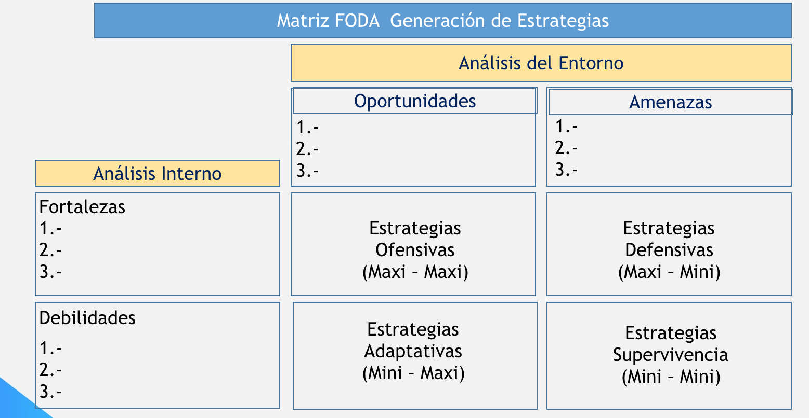

# 2017-09-20

## FODA (SWOT)

* Fortalezas (+) : Capacidades, recursos, etc que te dan un vantage point para hacer cosas chingonas. Fortalezas en exceso son debilidades.
* Oportunidades (+) : Todo aquel factor externo que facilite la ejecucion de algo. Una oportunidad que utilizas se trasnforma en fortaleza, si no se convierte en amenaza. Pero no hay que jugarle al v, no se deben tomar todas las oportunidades, solo aquellas que
* Debilidades (-) : Aspectos que limitan la capacidad de hacer algo. Lo que hago peor que lo sdemas
* Amenazas (-) : Fuerzas del entorno que eviten la ejecucion de una estrategia.

