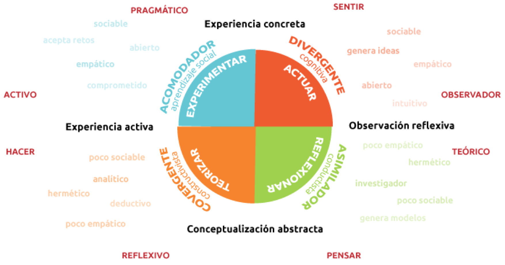

# 2017-09-27

## Modelo de Kolb

Hay 4 tipos de aprendizaje:

Tu forma de aprender te hace asumir que todas las demas personas van a aprender de la misma forma que tu. Se necesita ser mas empatico para comprender que no todos aprenden igual y aplicar ese conocimiento para poder enseñar a cada quien de la mejor manera.

## Estilos de Liderazgo
Existen 10 tipos de liderazgo:

* Autocratico: Poder absoluto
* Buroctarico: Seguir las reglas
* Carismatico: Inspiradores
* Democratico: Control de tu destino
* Dejalo ser: Deja a los demas trabajar por su cuenta
* Orientado a personas: Soporte y desarollo personal
* Natural: Todos participan
* Orientado a la tarea: Planificar y controlar tareas
* Transaccional: Liderazgo a corto plazo
* Transformacional: Propone nuevas iniciativas

Niveles de Liderazgo Inspiracional

1. Te siguen por tu posicion
2. Te siguen porque desean hacerlo
3. Te siguen porque das resultados
4. Te siguen porque haces cosas por las personas
5. Te siguen porque te tienen respeto

Respeto